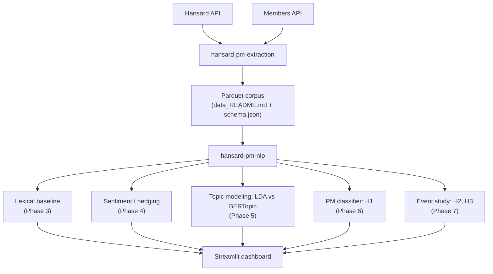

# hansard-pm-nlp

NLP analysis of UK Prime Ministers' rhetoric (2019-present), built on the parquet corpus produced by [`hansard-pm-extraction`](https://github.com/RedaAllab/hansard-pm-extraction). Second stage of a two-repository project; see that repo's `PROJECT_SUMMARY.md` for the full project (research question, hypotheses, roadmap) and `CLAUDE.md` for conventions.

**[Live dashboard](https://hansard-pm-nlp-nhenez39aujxgtejnyjvrg.streamlit.app)** · Four Prime Ministers (Johnson, Truss, Sunak, Starmer), 291 Commons sittings, four layered NLP analyses, tested against four pre-registered hypotheses.

**[Read the full write-up](WRITEUP.md)** for the reasoning behind each modeling choice and the complete results, including the null ones.

## Results by hypothesis

| Hypothesis | Method | Result |
|---|---|---|
| **H1** - PMs have a distinguishable stylometric signature | Logistic regression / HistGradientBoosting on lexical, readability, hedging, function-word, and POS features; temporal train/test split | **Confirmed.** 91.5% / 93.2% accuracy vs. 33.3% (uniform) / 49.2% (majority-class) chance baselines. |
| **H2** - Negative sentiment/hedging increase during crisis windows | OLS, PM fixed effects, one dummy per named crisis (Covid-19, mini-budget, Ukraine invasion, Labour leadership crisis) | **Null result.** No effect survives Benjamini-Hochberg correction. Closest raw effect (Covid-19 sentiment) points the *opposite* direction to the hypothesis. |
| **H3** - The crisis effect differs by governing party | OLS interaction term (pooled any-crisis x party, PM fixed effects), BH-corrected | **Null result**, and underpowered by construction - the Labour side is identified from a single crisis under a single PM. Flagged as a data-scope limitation in `PHASE0_SCOPING.md` before the corpus was even built. |
| **H4** - Topics drift continuously, with breaks at PM transitions (exploratory) | LDA (K=14) topic weights over time | Descriptive, not a formal test - see the dashboard's Topics tab and `phase5_lda_report.md`. |

Full statistical detail, caveats, and known limitations are in each phase's report under `data/processed/` - see the Pipeline table below.

## Architecture



## Pipeline

Each stage is a standalone module, runnable independently, writing its output to `data/processed/` alongside a markdown report.

| Phase | Module | Report |
|---|---|---|
| 2. Corpus construction | `build_corpus.py` (cleaning, debate-type tagging) | `data_README.md` |
| 3. Lexical baseline (TF-IDF, readability, lexical diversity) | `eda.py` | `eda_report.md` |
| 4. Sentiment / hedging | `affect.py` (VADER vs. transformer, custom hedging lexicon) | `affect_report.md` |
| 5. Topic modeling | `build_lda_topics.py` (LDA), `build_topic_comparison.py` (vs. BERTopic) | `phase5_lda_report.md`, `phase5_topic_comparison_report.md` |
| 6. PM-attribution classifier (H1) | `build_classifier.py` (logistic regression, HistGradientBoosting) | `phase6_classifier_report.md` |
| 7. Event-study regressions (H2, H3) | `build_event_study.py` (OLS, PM fixed effects, BH correction) | `phase7_event_study_report.md` |
| 8. Dashboard | `app/app.py` (Streamlit) | - |

Run any stage with `python -m hansard_pm_nlp.<module>`, e.g.:

```bash
python -m hansard_pm_nlp.build_corpus
python -m hansard_pm_nlp.eda
python -m hansard_pm_nlp.affect
python -m hansard_pm_nlp.build_lda_topics
python -m hansard_pm_nlp.build_classifier
python -m hansard_pm_nlp.build_event_study
```

Later stages depend on earlier stages' output already existing in `data/processed/`.

## Notebooks

`notebooks/` holds exploratory analysis that goes past each phase's summary report - full distributions instead of single means, face-validity checks on the sentiment/hedging scores, and sanity checks re-derived independently rather than trusted from a (possibly stale) report. All logic is imported from `src/hansard_pm_nlp/` per `CLAUDE.md` §6; nothing is redefined in-notebook.

| Notebook | Covers |
|---|---|
| `01_corpus_overview.ipynb` | Volume/PMQs split by PM, contribution-length distribution, sitting calendar, re-derived duplicate-row check |
| `02_lexical_deep_dive.ipynb` | Full readability/sentence-length distributions, a direct visual demonstration of TTR's length bias (why MTLD was chosen), full n-gram/TF-IDF tables |
| `03_sentiment_validation.ipynb` | VADER vs. transformer disagreement rate and real disagreement examples (two distinct, genre-specific failure modes, not "one method is better"), hedging lexicon spot-check, the PMQs hedging paradox from `affect.py` |

Outputs are committed (charts render directly on GitHub). To re-run: `pip install -e ".[dev]"` (adds jupyter/matplotlib/seaborn on top of the base deps), then `jupyter nbconvert --to notebook --execute --inplace notebooks/*.ipynb`.

## Dashboard

```bash
streamlit run app/app.py
```

Four tabs: stylometric profile by PM (radar chart, normalized to the currently-selected PMs so deselecting an outlier rescales the rest, a TF-IDF distinctive-terms chart, and MTLD recomputed monthly per PM to show lexical-diversity drift within a tenure rather than one whole-corpus number), sentiment/certainty over time (crisis windows, crisis-vs-baseline box plots for H2/H3, and a PMQs-vs-other-debates split), LDA topics over time (crisis windows, dotted PM-transition lines, and a cross-sectional topic-by-PM heatmap), and the PM-attribution classifier's results (confusion matrix with click-to-drill-down into the underlying sittings). Filters (PM, date range) apply per tab, scoped to what the underlying data supports - see the in-app captions. Transform logic behind these charts lives in `src/hansard_pm_nlp/dashboard_helpers.py` (unit tested, `tests/test_dashboard_helpers.py`), not inlined in the Streamlit script.

The topics tab sums the one *documented* near-duplicate topic pair (T0+T1, both Ukraine/Russia/security - see `phase5_lda_report.md`) into a single series for display, 14 topics down to 13. The three Covid-related topics (restrictions/testing, vaccines/schools, NHS pay/inquiry) are deliberately left separate rather than also merged - they look similar at a glance but track genuinely distinct sub-phases, and merging them would erase the thematic drift the chart exists to show.

`.streamlit/config.toml` pins `theme.base = "dark"`. Without it Streamlit follows the *viewer's* OS/browser color-scheme preference, and every chart's Plotly styling (`_dark()` in `app.py`) assumes a dark canvas - a light-mode viewer would get Plotly's pastel qualitative palette on a white background instead of the intended dark theme, which is illegible on some charts (this is what produced washed-out screenshots during development). Pinning the theme makes the dashboard look the same for every viewer regardless of their system settings.

The dashboard only reads precomputed artifacts from `data/processed/` (parquet/CSV) and the already-trained LDA model - it never calls `sentiment.py`, `bertopic_model.py`, `classifier.py`, or `style_features.py` at runtime, so `requirements-app.txt` (streamlit, plotly, pandas, pyarrow, gensim only) is enough to run it:

```bash
pip install -r requirements-app.txt
streamlit run app/app.py
```

**Note on Streamlit Community Cloud specifically**: it detects `pyproject.toml` at the repo root and installs the full dependency set via Poetry regardless of `requirements-app.txt` - there is no working override for this. The practical effect is a slower build (torch, transformers, bertopic, and spacy all get installed even though the dashboard never imports them), not a broken one - as long as the Python version is compatible. Two things were needed to get a working deploy: `requires-python` capped at `<3.14` in `pyproject.toml` (spacy doesn't support 3.14+ yet), *and* explicitly selecting Python 3.12 in the app's Streamlit Cloud settings (General → Python version) - the platform's default interpreter at deploy time was 3.14.6, and `requires-python` alone doesn't make Poetry switch interpreters, only validates against whichever one is already active. `requirements-app.txt` still documents the dashboard's true minimal footprint and works as expected on hosts that respect `requirements.txt` (Render, Railway, etc.).

## Setup

```bash
python3 -m venv .venv
source .venv/bin/activate
pip install -e ".[dev]"
python -m spacy download en_core_web_sm
```

Requires the corpus from `hansard-pm-extraction` in `data/input/` - see `data/input/README.md` for provenance.

## Tests

```bash
pytest
ruff check .
```

## Known limitations

Documented in the reports rather than hidden:

- **Topic modeling**: LDA (K=14) chosen over BERTopic, whose default UMAP+HDBSCAN pipeline collapses this 296-document corpus into 1-2 broad clusters - a corpus-size limitation, not evidence LDA's topics are objectively better (`phase5_topic_comparison_report.md`). LDA topics 0 and 1 (both Ukraine/Russia/security) overlap by design, read as a real structural feature of the corpus rather than a preprocessing artifact.
- **Classifier (H1)**: Liz Truss excluded (5 documents, 49-day tenure - too few for reliable per-class metrics). Train/test split is temporal (by date within each PM's tenure), not random, so the test score reflects generalization to later sittings, not a leaked news cycle.
- **Event study (H2, H3)**: no effect survives Benjamini-Hochberg correction for either hypothesis - reported as a genuine null result. Per-crisis x party interactions are not identifiable (each named crisis window overlaps exactly one party's tenure in this corpus); H3 instead tests a pooled any-crisis x party interaction.
